## Docker 


로컬에서 잘 실행되는 Spring Boot 프로젝트를 Naver Cloud Platform(NCP) 서버에서 실행시켜 보려고 한다.


#### 작업 순서

1. Local에서 Docker에 Container와 Image 만들기
2. DockerHub에 Image push하기
3. 원격 서버에서 Image pull하기<br>


##### Local에서 Docker에 Container와 Image 만들기

---

먼저 프로젝트 내의 설정을 변경해주어야 한다.<br>


- build.gradle 에서 다음과 같은 코드를 추가한다.


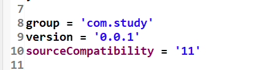


- 프로젝트 바로 아래 Dockerfile을 생성해준다.(이름이 꼭 Dockerfile 이어야 한다.)

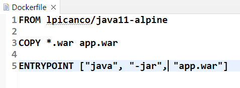


- application.properties 설정을 변경해준다.

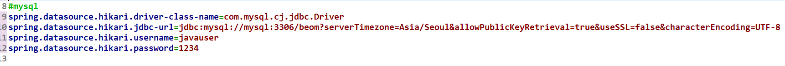

여기서 주의할 점이 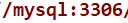

이 부분이다. "mysql" 은 추후에 생성할 mysql docker image의 이름이다. <br><br>


이제 war 파일을 만들어 주면 된다.

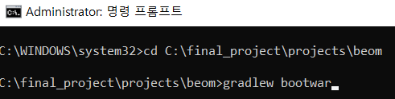


war 파일이 잘 만들어졌는지는 다음과 같이 확인하면 된다.

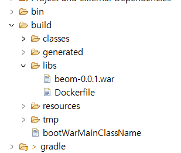

위 사진처럼 만들어놓은 Dockerfile의 위치를 변경한다.

<br><br><br>


[Docker 설치](https://www.docker.com/get-started/) --> DockerHub 계정을 생성하고 Docker Desktop을 OS에 맞게 설치한다.<br>

이제 cmd or windows powershell을 이용해 docker image를 만들 것이다.<br>

먼저 CLI(cmd,powershell etc...)내에 Docker를 설치한다. ([sudo 없이 사용하기](https://subicura.com/2017/01/19/docker-guide-for-beginners-2.html) 해당 링크를 이용하면 sudo를 생략할 수 있다.)<br>

```cd build/libs``` : 폴더 위치 이동

```docker login``` : docker 계정과 연결한다.

<br>

```docker network create [이름]``` --> ```docker network ls``` 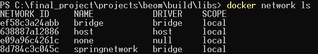

(내가 만든 network는 "springnetwork")

```docker volume create [이름]``` --> ```docker volume ls``` 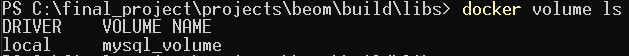


```docker pull mysql ``` : mysql image 생성

```docker run -d --name [mysql container 별명] -e MYSQL_ROOT_PASSWORD=[root 계정 비밀번호] -p 3306:3306 --network [network id] -v [volume name]:/var/lib/mysql mysql``` : mysql container 생성 및 실행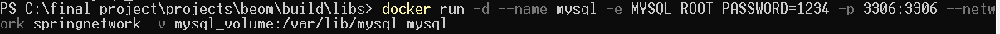


```docker build -t [war파일 이름] .``` : 프로젝트 image 생성 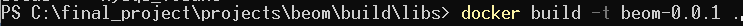

```docker run -it --name [프로젝트 container 별명] --network [network id] -p 8000:8000 [war파일 이름] bash``` : 프로젝트 container 생성 및 실행 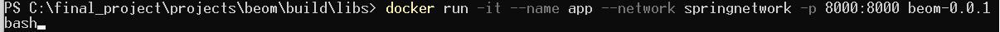

<br><br><br>


##### DockerHub에 Image push하기

---


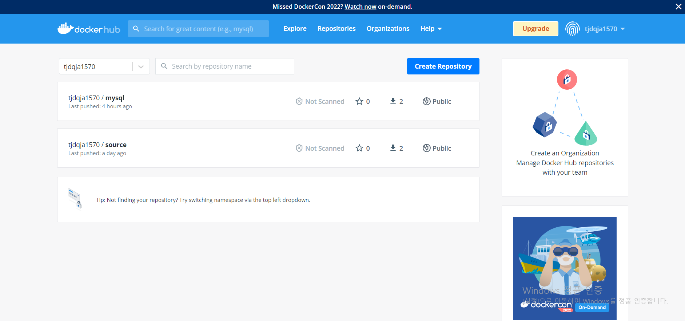

DockerHub에 접속해 다음과 같이 두 개의 repository를 create한다.


```docker tag [이미지 별명] [repository 이름]``` : tag를 이용해 DockerHub로 Push하기 위한 연결과정을 실행한다.

```docker push [repository 이름]``` : DockerHub로 Push한다.

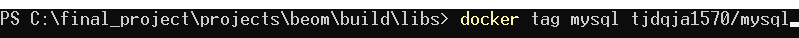

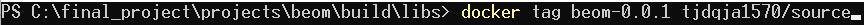

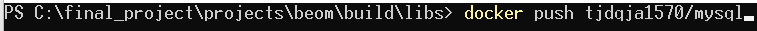


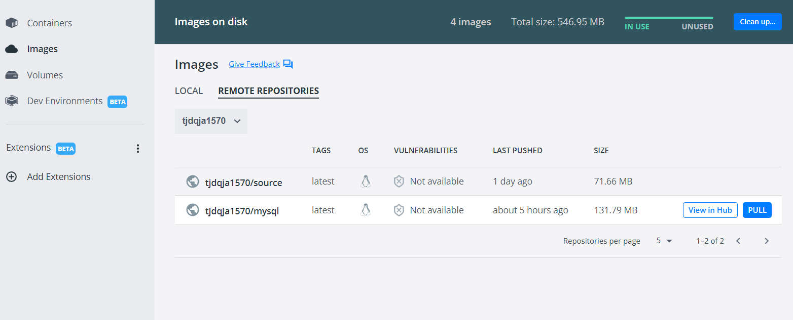

성공적으로 push 됐다면 위 사진처럼 repositories가 보일 것이다.

<br><br><br>


##### 원격 서버에서 Image pull하기

---


